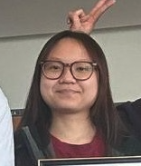

# We Are Thrilled To Have You Here

The Vietnamese Student Association (VSA) at Sheridan College is dedicated to helping Vietnamese students adapt to life abroad and engage in building a vibrant community. Our mission is to provide support, foster connections, and create opportunities for personal and professional growth. Join us to make the most of your experience at Sheridan College and beyond!

## Meet Our Members

|  |  |  |
|:----------------------------------------------------:|:------------------------------------------------:|:------------------------------------------------:|
| **Ben Nguyen**                                       | **Manh Phu Giang**                                | **Tam Nguyen**                                   |
| President                                            | Student Relation                                  | VP - Social Media Coordinator                    |

|  |  |  |
|:-------------------------------------------------:|:-------------------------------------------------:|:-------------------------------------------------:|
| **Tan Pham**                                      | **Tung Le**                                       | **Minh Anh**                                      |
| VC - Event Planner                                | Social Media Coordinator                          | Account Manager                                   |

|  |
|:------------------------------------------------:|
| **Vu Anh Huy Nguyen**                            |
| Event Planner                                    |

