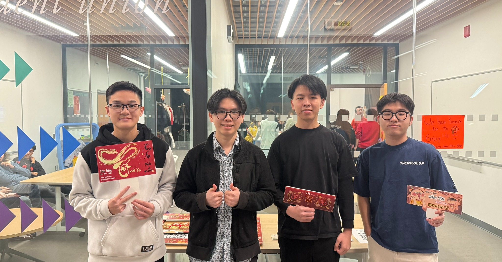
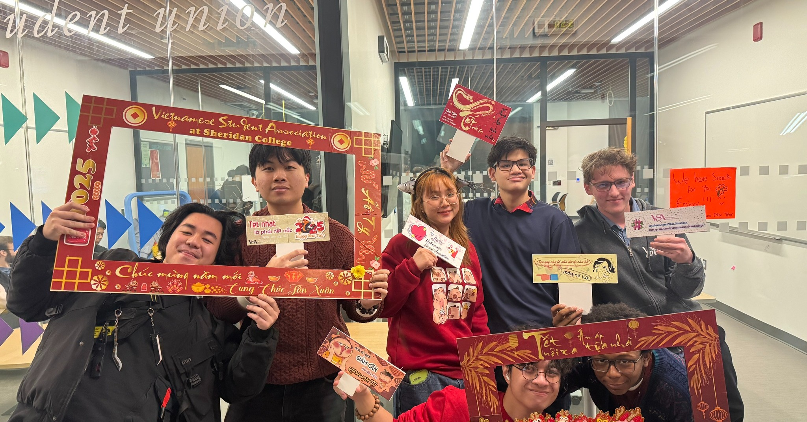
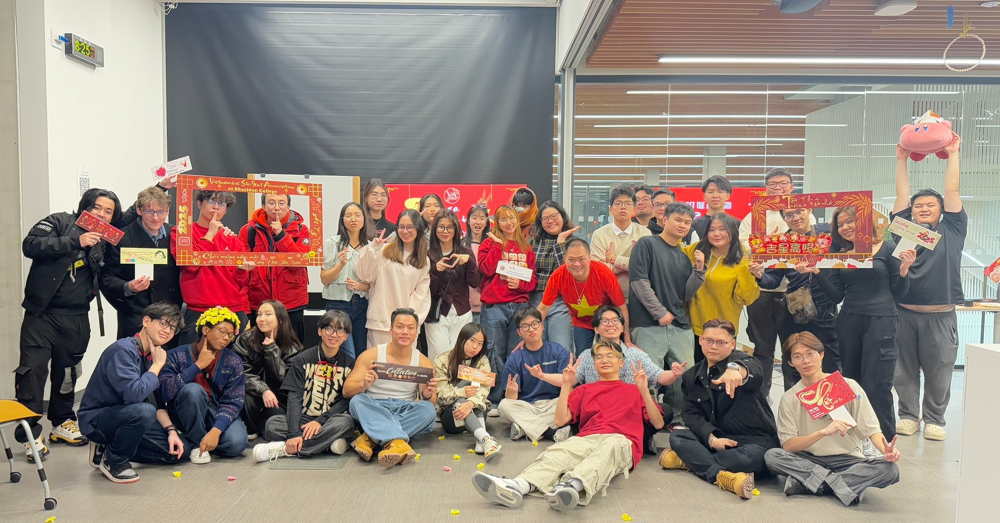
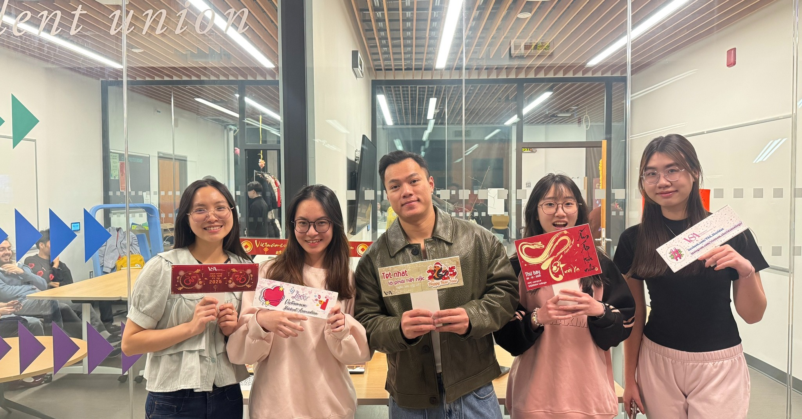
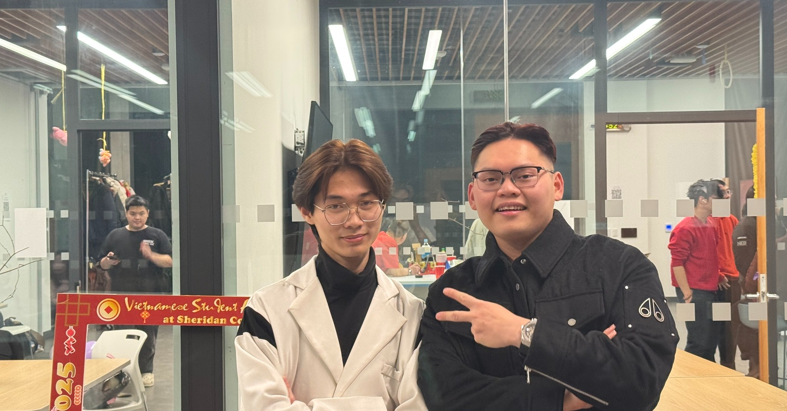

[𝐄𝐯𝐞𝐧𝐭 𝐓𝐞̂́𝐭 𝐍𝐠𝐮𝐲𝐞̂𝐧 Đ𝐚́𝐧 𝟐𝟎𝟐𝟓] 🧧 “𝐓𝐞̂́𝐭 𝐧𝐨̛𝐢 𝐱𝐚 - 𝐀̂́𝐦 𝐚́𝐩 𝐭𝐮̛̣𝐚 𝐧𝐡𝐚̀” 🧧  
“Mừng Tết đến, vạn lộc đến nhà nhà
Cánh mai vàng, cành đào hồng thắm tươi”  

Tết đến Xuân về cũng là lúc lòng người nôn nao, háo hức đón chào một năm mới. Căn bếp nhỏ của mỗi gia đình ngày đêm đỏ lửa cùng nồi bánh chưng, thịt kho tàu. Đám trẻ trong xóm thì xum xoe tà áo mới, người lớn trong nhà bận bịu cùng nhánh mai, cành đào… Tất cả những ấm áp sum vầy, tụ hội về cùng những đứa con tha hương quanh mâm cơm ngày Tết. Những hình ảnh và ký ức đó ắt hẳn mãi không thể nào mờ phai trong tâm trí của mỗi người con đất Việt.  

Với du học sinh xa xứ bọn mình, thôi thì đành tìm lại những dư vị ấm áp của mùa xuân năm cũ trong sự kiện sắp tới của VSA mọi người nhé. Chúng tôi và chúng ta mong muốn mang lại sự kiện này cho các bạn, để giữ lửa cho những nét đẹp truyền thống văn hoá của Việt Nam, để bè bạn khắp nơi hiểu được những tập tục đa sắc màu của người Việt, và cũng để chúng mình vơi đi phần nào nỗi nhớ quê, tiếp thêm động lực để bước đến tận cuối con đường thành công sắp tới.  

🌸 “𝐓𝐞̂́𝐭 𝐍𝐨̛𝐢 𝐗𝐚 - 𝐀̂́𝐦 𝐀́𝐩 𝐓𝐮̛̣𝐚 𝐍𝐡𝐚̀” - VSA Lunar New Year 2025 🌸
🧧 VSA thật hạnh phúc khi được cùng các bạn tái hiện một góc xuân Việt với những hoạt động ý nghĩa như thi thời trang giấy, trang trí cành mai, cành đào, và các trò chơi dân gian đầy niềm vui. Những tiếng cười và khoảnh khắc sum vầy chính là điều làm nên sự đặc biệt của sự kiện lần này. 💖
Cảm ơn các bạn đã cùng VSA biến Tết xa nhà thành một mùa xuân thật gần gũi và ấm áp. Đây là phát súng đầu tiên trong chuỗi các sự kiện của VSA trong năm 2025 nhé. Mọi người đừng quên tiếp tục đồng hành cùng tụi mình trong những sự kiện sắp tới, để chúng ta luôn giữ lửa truyền thống, tựa như một gia đình nhỏ nơi xứ người.
Happy Lunar New Year 2025 nhéee!


  
  
  
  
  

