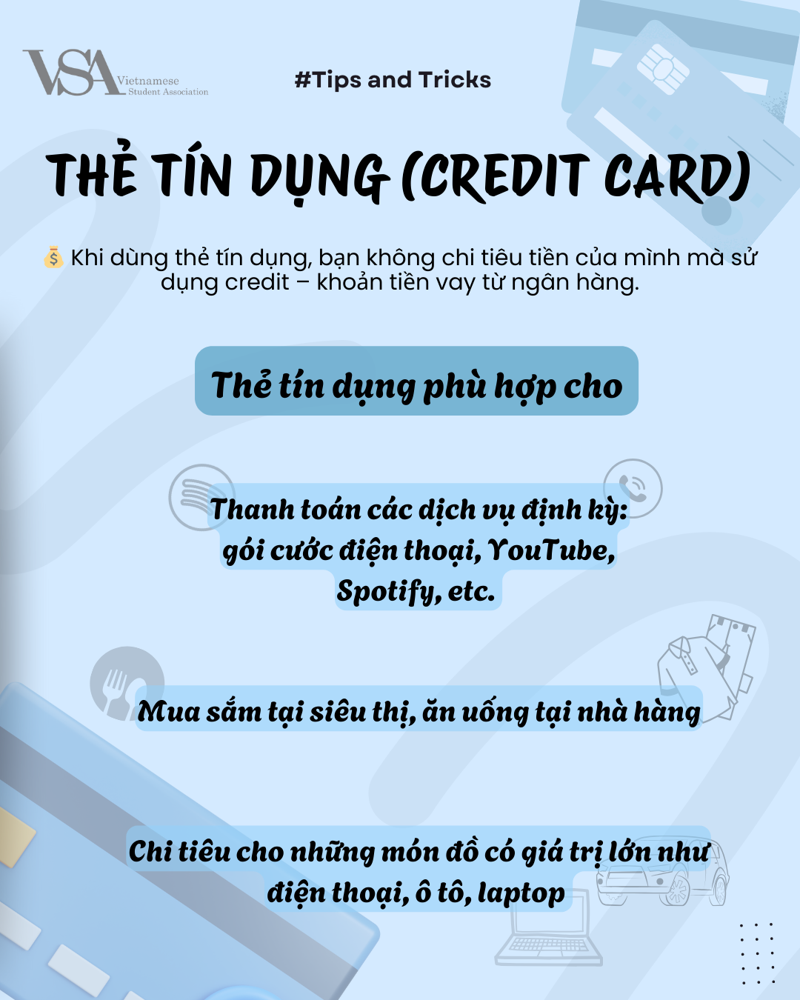
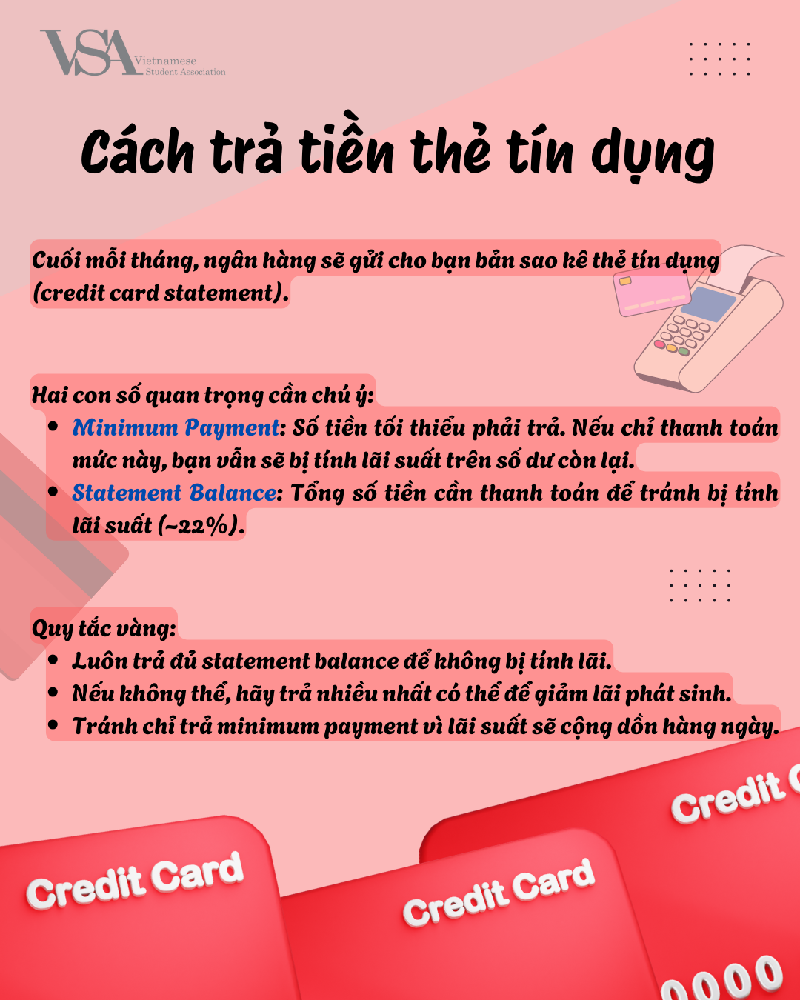

### Thẻ Debit & Credit – Bạn đã dùng đúng chưa? 🤔


New article!


Việc sử dụng thẻ Debit hay Credit tưởng chừng đơn giản nhưng thực tế lại không hề dễ dàng! Nếu sử dụng đúng cách, bạn sẽ nhận được nhiều lợi ích, nhưng nếu sử dụng sai, ví tiền của bạn sẽ bị ảnh hưởng và điểm tín dụng cũng sẽ giảm theo… 😢

Vì vậy, chúng tôi gửi đến bạn một hướng dẫn chi tiết trong hình bên dưới – giúp bạn biết khi nào nên sử dụng thẻ debit, khi nào nên sử dụng thẻ credit, tránh rơi vào bẫy lãi suất cao không đáng có! 💳

Nếu thấy hữu ích, hãy lưu lại ngay. Nếu bạn có thêm mẹo sử dụng thẻ thông minh, hãy bình luận chia sẻ để mọi người cùng biết nhé! 💡

Hãy cùng nhau tiêu dùng hợp lý hơn mỗi ngày! 💪

