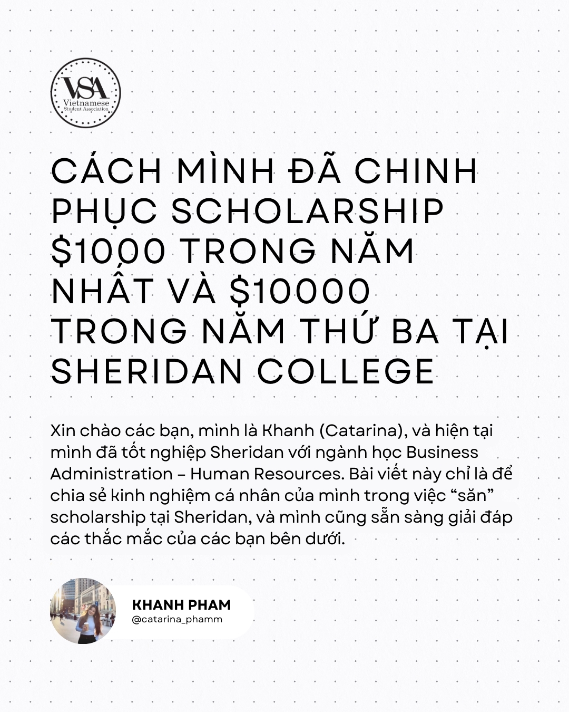
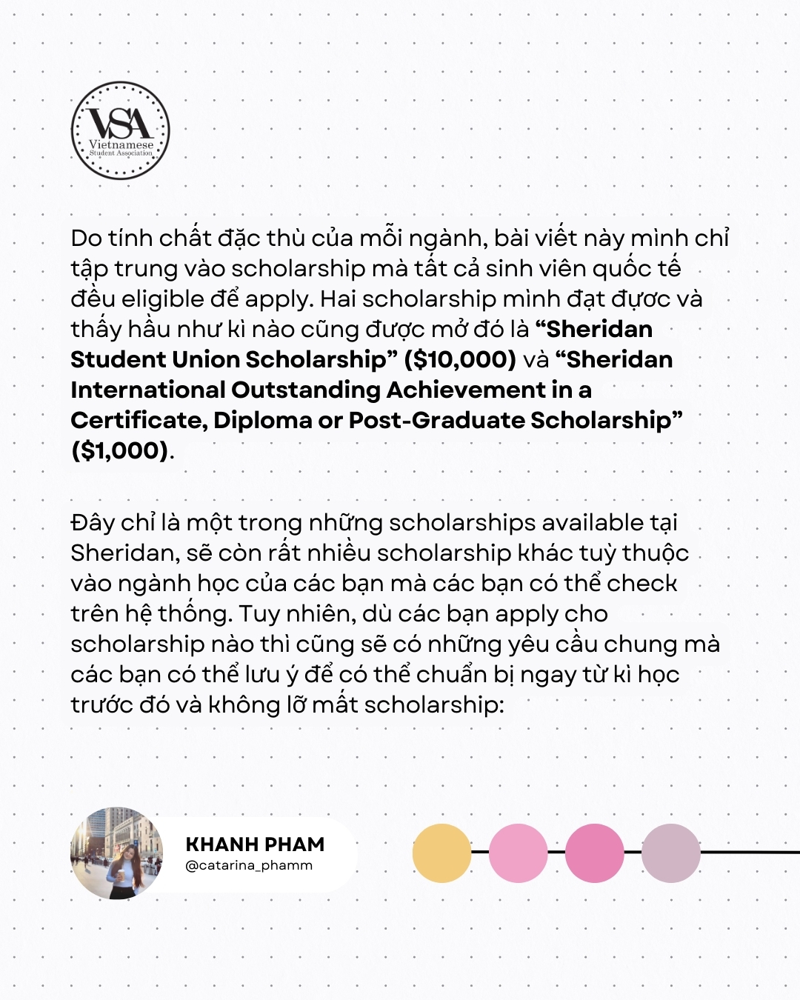
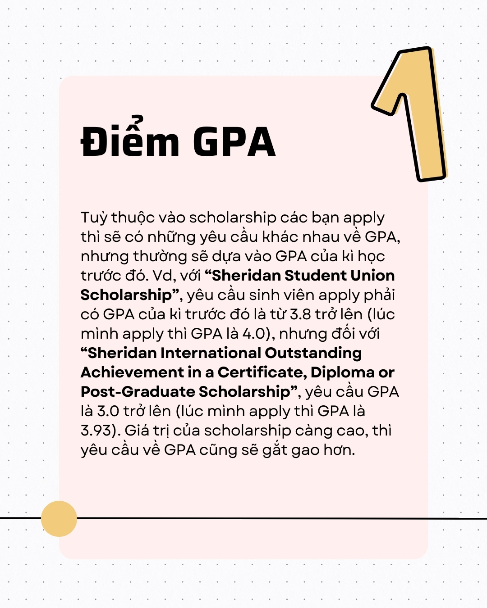
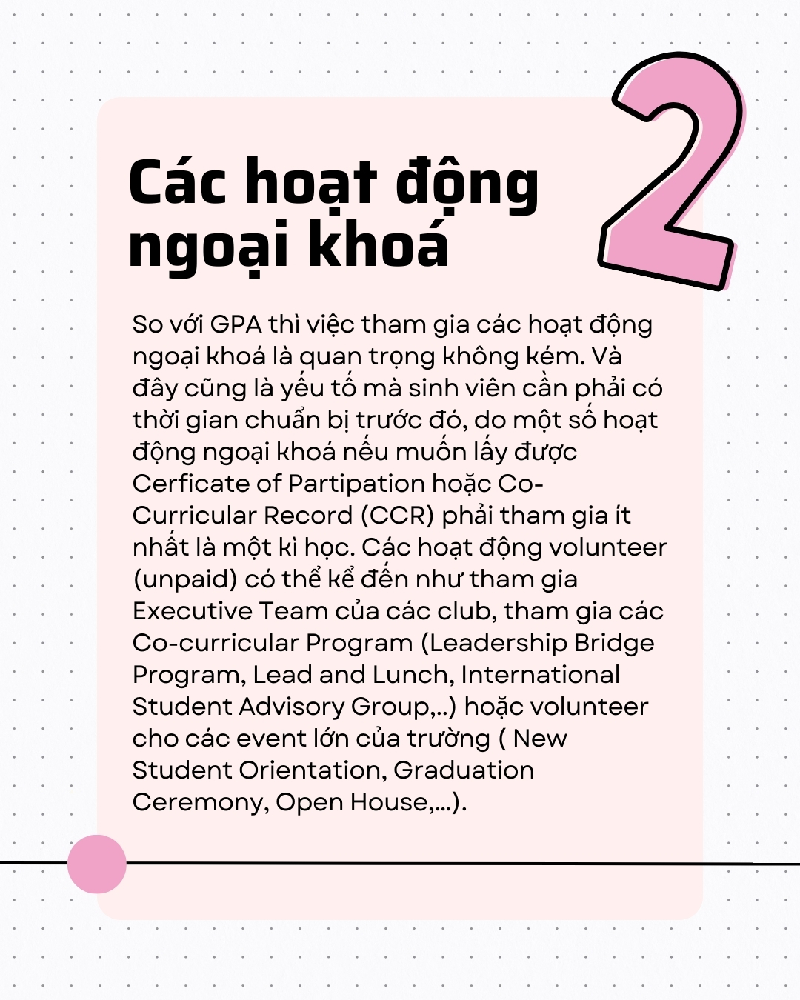
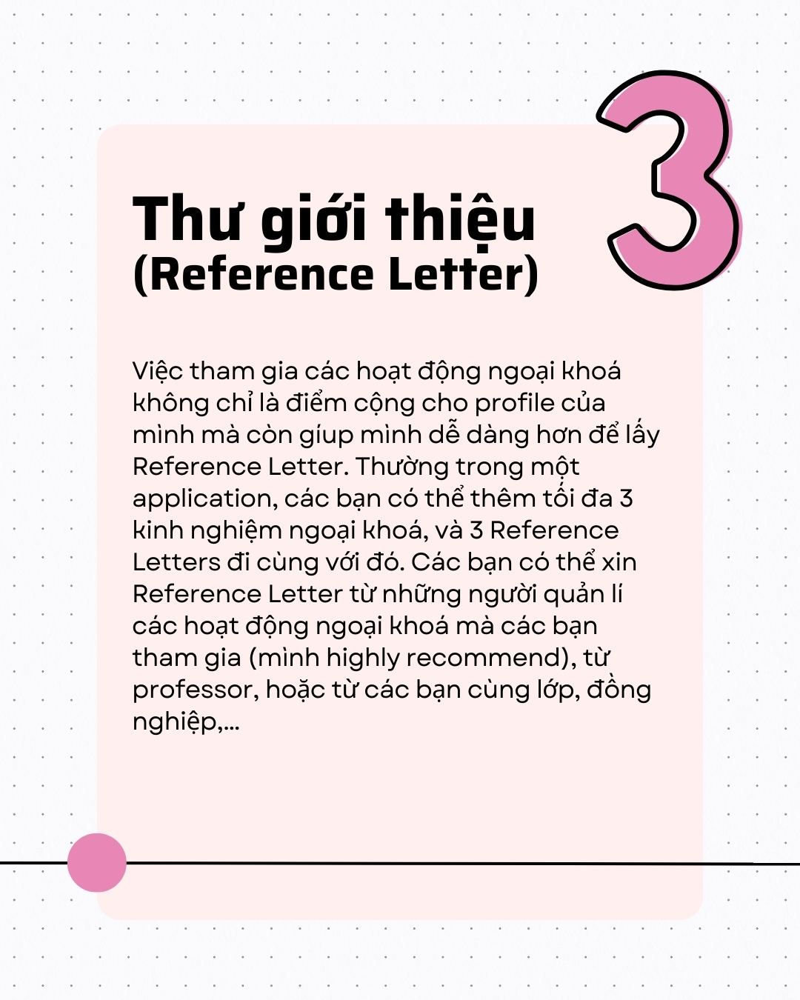
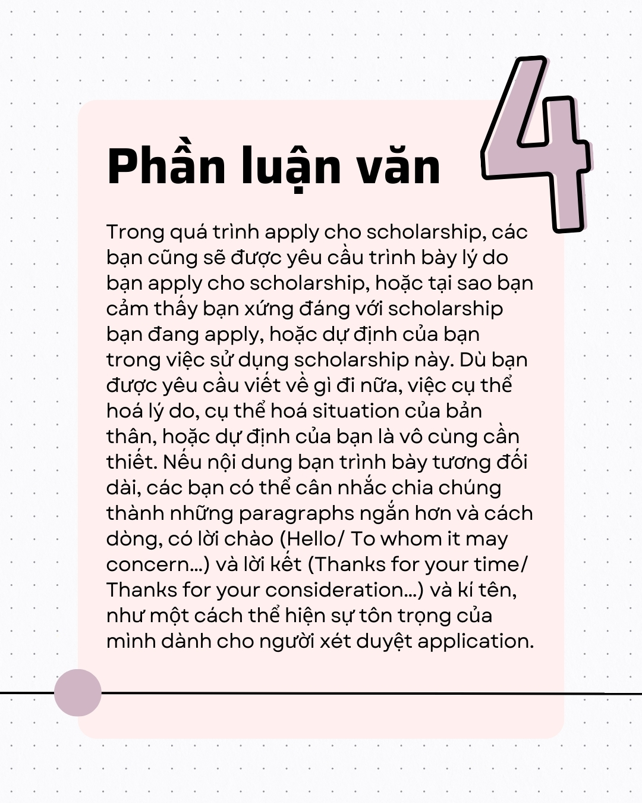
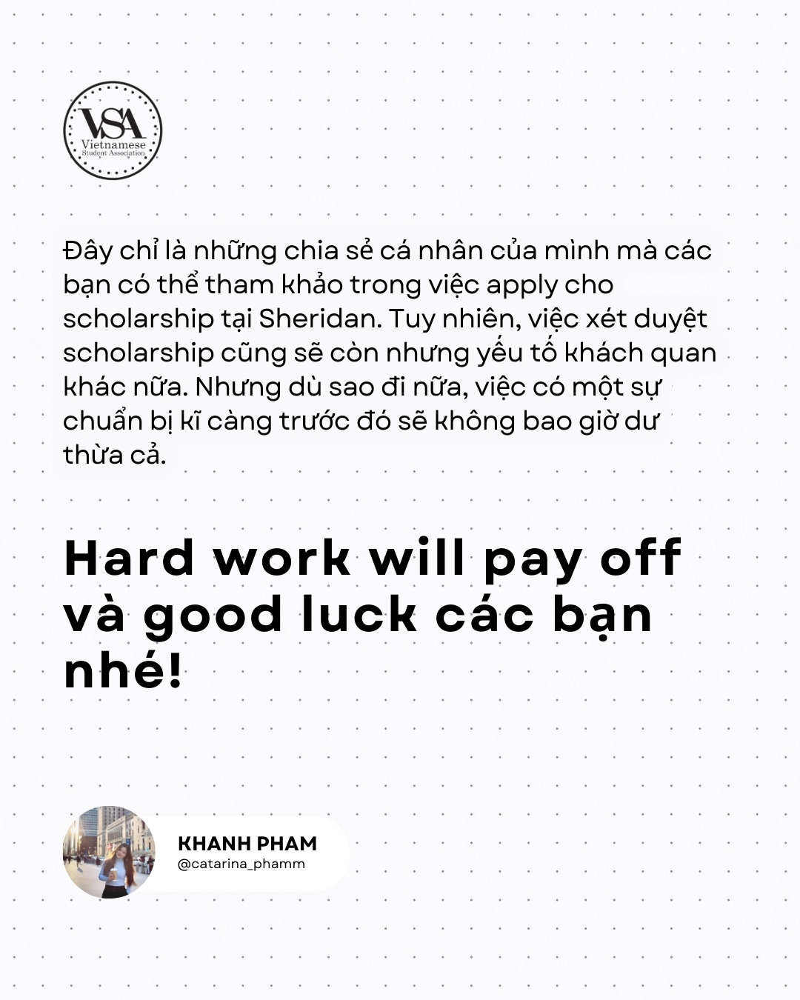
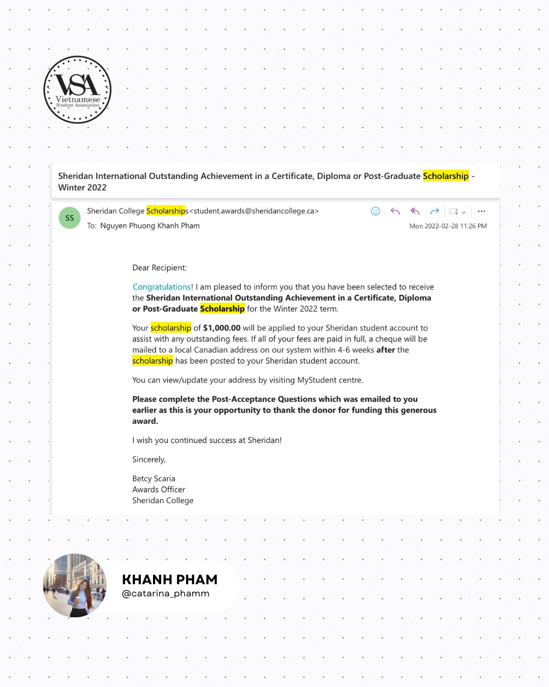
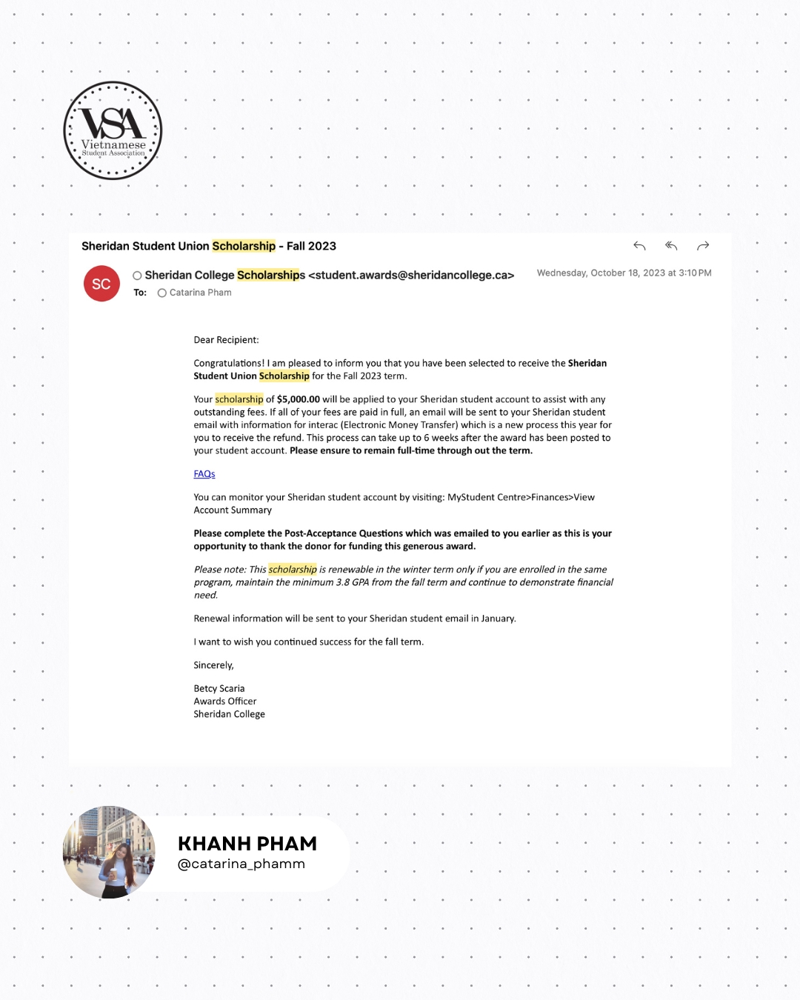
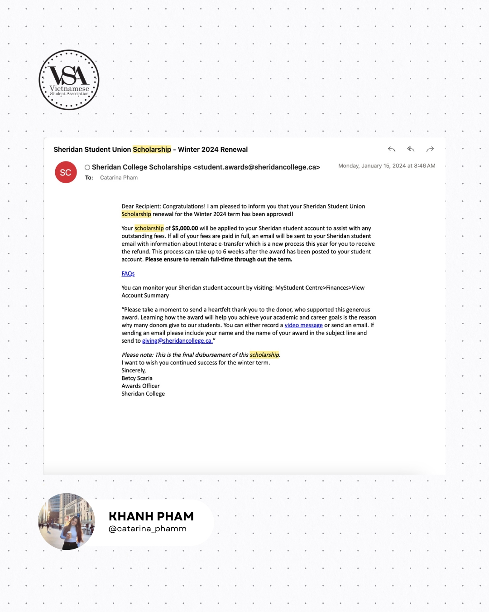

Hé loo mọi người, lại là VSA tụi mình đây!  
Tết đang đến gần, và VSA rất vui khi được đồng hành cùng các bạn trong không khí chuẩn bị cho một năm mới đầy hứa hẹn. Nhưng bên cạnh những niềm vui ngày Tết, tụi mình cũng không quên rằng kỳ học Winter 2025 đã bắt đầu. Nhưng các bạn biết gì không, tin vui chính là: ở mỗi đầu kì học, Sheridan sẽ có rất nhiều Scholarship và Bursaries dành cho tất cả sinh viên đang theo học tại Sheridan.    
Do đó, nhân tuần đầu comeback to school, VSA của tụi mình hy vọng có thể đem đến cho các bạn những chia sẻ từ chính “người trong cuộc” trong hành trình săn scholarship tại Sheridan.  
Sẽ có rất nhiều yếu tố quyết định đến việc bạn apply cho Scholarship, nhưng dưới đây mình chỉ đề cập đến 4 điều cơ bản nhất:  
1. GPA  
2. Hoạt động ngoại khoá   
3. Thư giới thiệu   
4. Bài luận  
Link hướng dẫn apply Scholarship từ Sheridan nhé: https://hub.sheridancollege.ca/how-do-i-access-the-online...    
Để có thể tìm hiểu chi tiết hơn về những chia sẻ trên thì các bạn nhấn vô xem những hình ảnh ở dưới nhé.


  
  
  
  
  
  
  
  
  
  

